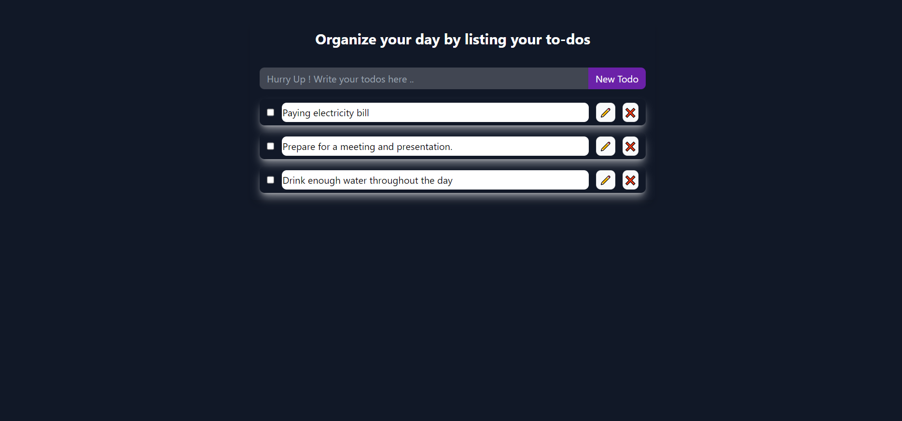

# To-Do Website

Welcome to the To-Do website! This project is built using React, HTML, CSS, and JavaScript to provide a user-friendly platform for managing tasks.

## How to access

   You can visit the live site at:
   [https://todo-app-anushka.vercel.app/]

## Installation

To run this project locally, follow these steps:

**Steps:**

1. Clone the repository: `git clone https://github.com/anushka712/Todos.git` 

2. Navigate the project directory:`cd Todos`

3. Install dependencies:`npm install`

4. Start the server:`npm run dev`

   

